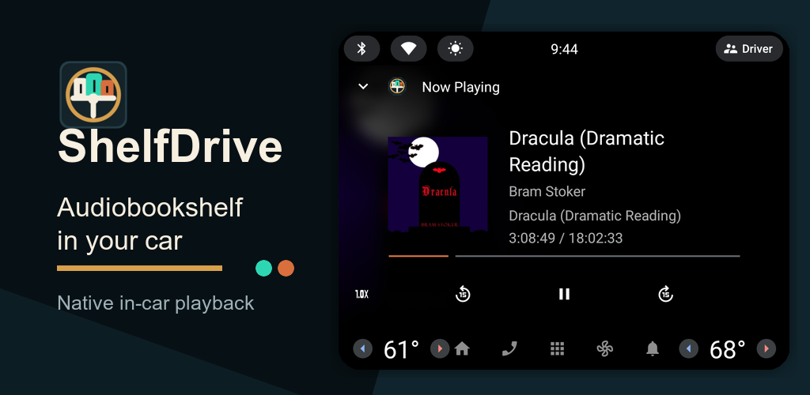
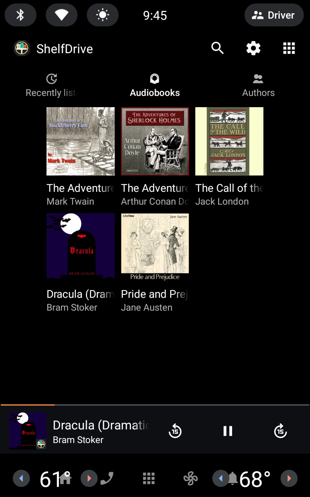
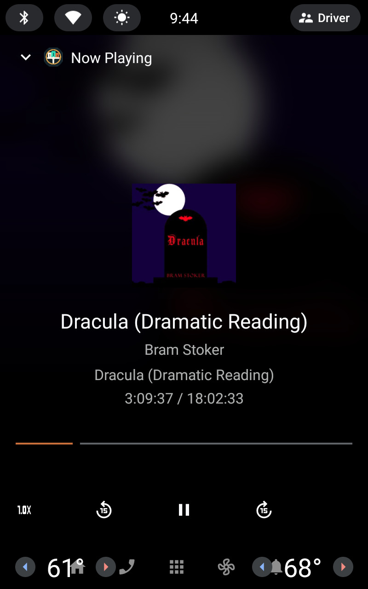
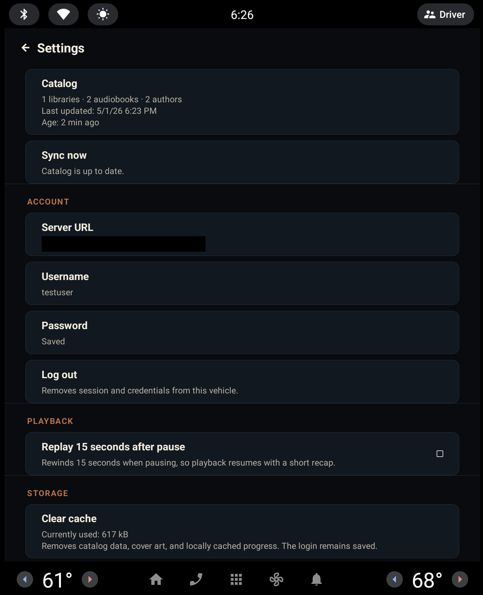

<p align="center">
  
</p>

<h1 align="center">ShelfDrive</h1>

<p align="center">
  An Android Automotive OS media app for Audiobookshelf.
</p>

<p align="center">
  
  
  
  
  
</p>

<p align="center">
  
</p>

ShelfDrive connects an Android Automotive OS vehicle to a self-hosted
[Audiobookshelf](https://www.audiobookshelf.org/) server. It exposes your
audiobook library through the native AAOS media experience instead of shipping
a custom player UI.

The app is built as a Media3 library/session source: browsing, search, now
playing, transport controls, artwork, queue handling, and voice/media actions
are provided through Android media APIs and rendered by the vehicle media host.

ShelfDrive is an independent project and is not affiliated with Audiobookshelf.

> [!WARNING]
> AI Disclaimer:
> This project was built with substantial AI assistance. It works for my environment/use cases but may fail on other cars. The code, documentation, architecture, and implementation details should be reviewed before production use.

> [!NOTE]
> The app is currently only available via my internal test track on the Google Play Store. If you accept the alpha stage you can reach out (dsaos9632@gmail.com) and get invited to try it yourself. A public release is not yet planned.

## Screenshots

| Library | Now Playing | Settings |
| --- | --- | --- |
|  |  |  |

## Status

ShelfDrive is alpha software for personal testing on Android Automotive OS.

Current app metadata:

- App name: `ShelfDrive`
- Application ID: `io.shelfdrive.app`
- Version: `0.3.1`
- Minimum SDK: `29`
- Target SDK: `35`
- Supported form factor: Android Automotive OS
- Supported Audiobookshelf media type: book libraries
- Languages: English and German

## Features

- Browse Audiobookshelf book libraries as one combined catalog.
- Open sections for recently listened books, all audiobooks, and authors.
- Display server-provided audiobook covers and author images.
- Search the local synced audiobook catalog from the AAOS media host.
- Play MP3 and M4B audiobooks through ExoPlayer.
- Use native AAOS now-playing, skip, seek, speed, and media controls.
- Cycle playback speed from the now-playing controls through AAOS-supported values.
- Sync playback progress back to Audiobookshelf while playback is active.
- Keep Audiobookshelf as the source of truth for listening progress.
- Restore the last local playback state after app or vehicle restarts, including immediate AAOS media metadata while the server session is refreshed.
- Optionally rewind 15 seconds when pausing, so resume starts with a short recap.
- Configure server URL, username, password, connection state, sync state, and cache actions in Settings.
- Cache catalog data, artwork, and a bounded 128 MB opportunistic audio buffer locally.

## Non-Goals

- Podcast support.
- Offline downloads.
- A phone/tablet UI.
- A custom in-app player screen.
- Built-in VPN, WireGuard, reverse proxy, or tunnel management.
- Local listening history that diverges from Audiobookshelf.

## Requirements

To use the app:

- An Android Automotive OS vehicle or emulator with a compatible media host.
- An Audiobookshelf server reachable from the vehicle.
- At least one Audiobookshelf library with media type `books`.
- Audiobook files playable by ExoPlayer, such as MP3 or M4B.

For local development:

- Android Studio.
- JDK 17 or newer.
- Android SDK with an Android Automotive OS emulator image.

For emulator testing, use a server URL that is reachable from inside the
emulator. Desktop hostnames often do not resolve in AAOS images; use a LAN IP or
`10.0.2.2` where appropriate.

## Setup

1. Install ShelfDrive on the AAOS device or emulator.
2. Open ShelfDrive from the vehicle launcher or media app list.
3. Open Settings from the media host settings affordance.
4. Enter the Audiobookshelf server URL, username, and password.
5. Log in and run a catalog sync.
6. Return to the media view and browse recently listened books, audiobooks, or authors.

ShelfDrive is online-first. Starting playback requires the Audiobookshelf server
because the app resolves a playback session and stream URLs at play time.
When a previous playback item exists locally, ShelfDrive publishes its saved
metadata to AAOS immediately so the media host can keep showing the current
title while the online playback session is refreshed.

## Playback And Progress

ShelfDrive resolves playback through the Audiobookshelf API, builds an ExoPlayer
queue from the returned audio tracks, and reports progress back to the server.

Progress behavior:

- Periodic progress updates are sent while playback is active.
- Pause, stop, seek, track change, and completion trigger progress updates.
- Finished books are hidden from the local continue-listening cache.
- If progress changes on another device while ShelfDrive is already playing, the current playback session is not live-merged.
- Failed progress updates are not queued for offline replay.

The optional 15-second pause rewind changes the actual player position before
the pause progress is synced. Pressing play again resumes from the rewound
position.

After a restart, restored playback is kept idle until the user presses play.
This preserves the AAOS browse root while still keeping the last title available
in the mini-player.

## Settings

The Settings screen is intentionally focused and vehicle-friendly:

- Connection state.
- Authentication state.
- Synced catalog counts.
- Manual catalog resync.
- Server URL, username, and password.
- Login/logout action.
- 15-second rewind-on-pause toggle.
- Cache usage and clear-cache action.
- App version.

## Cache Policy

ShelfDrive stores a local catalog cache in Room, artwork in the app cache
directory, and a bounded 128 MB opportunistic ExoPlayer audio cache. The cache is
used for browsing, media host presentation, and faster warm resumes; the
Audiobookshelf server remains the authority for catalog, stream authorization,
and progress data.

The cache can be cleared from Settings. Android may also clear app cache files
under storage pressure. App uninstall removes all local app data.

## Security And Privacy

- Credentials and tokens are stored with AndroidX Security encrypted preferences.
- Android backup is disabled for ShelfDrive app data.
- The app communicates only with the Audiobookshelf server URL configured by the user.
- Cleartext HTTP is allowed for local/private Audiobookshelf servers, but HTTPS is recommended for remote access.
- No analytics, ads, or tracking SDKs are included.

For more detail, see the [Privacy Policy](docs/PRIVACY_POLICY.md).

## Architecture

ShelfDrive is built around Android media primitives:

- `MediaLibraryService` exposes the browsable audiobook catalog.
- Media3 `MediaSession` publishes metadata, playback state, and transport actions.
- Media3 custom commands provide 15-second seek controls and playback-speed cycling.
- ExoPlayer handles audiobook playback with a bounded local audio cache.
- Room stores the local catalog and progress cache.
- AndroidX Security stores credentials and tokens.
- A content provider serves authenticated artwork to the media host.

The vehicle media host renders the primary UI. ShelfDrive only provides a
settings activity for account, connection, playback, and cache preferences.

## Build

`local.properties` is intentionally not committed. Android Studio creates it for
your local SDK path. For command-line builds, ensure `ANDROID_HOME` points to
your Android SDK.

Build a debug APK:

```bash
./gradlew assembleDebug
```

Run unit tests:

```bash
./gradlew testDebugUnitTest
```

Run lint:

```bash
./gradlew lintDebug
```

Run the full local verification used before release builds:

```bash
./gradlew lintDebug testDebugUnitTest assembleRelease bundleRelease
```

## Release Builds

Release signing uses a local, untracked `keystore.properties` file. Copy
`keystore.properties.example` to `keystore.properties`, fill in your upload-key
data, then build the Android App Bundle:

```bash
./gradlew bundleRelease
```

The Play Console artifact is:

```text
app/build/outputs/bundle/release/app-release.aab
```

If `keystore.properties` does not exist, Gradle may still create an unsigned
release bundle for compile verification. Do not upload an unsigned bundle to
Google Play.

For Android Automotive OS internal testing, see
[PLAY_STORE_INTERNAL_TEST.md](docs/PLAY_STORE_INTERNAL_TEST.md).

## Repository Layout

```text
app/src/main/java/io/audiobookshelf/aaos/absapi      Audiobookshelf API client
app/src/main/java/io/audiobookshelf/aaos/account     Android account integration
app/src/main/java/io/audiobookshelf/aaos/artwork     Artwork content provider
app/src/main/java/io/audiobookshelf/aaos/auth        Authentication and encrypted storage
app/src/main/java/io/audiobookshelf/aaos/browser     Browse node IDs and catalog repository
app/src/main/java/io/audiobookshelf/aaos/cache       Local cache handling
app/src/main/java/io/audiobookshelf/aaos/catalog     Room database entities and DAOs
app/src/main/java/io/audiobookshelf/aaos/host        Media host launch intents
app/src/main/java/io/audiobookshelf/aaos/media3      Media3 library/session service and catalog
app/src/main/java/io/audiobookshelf/aaos/playback    Playback resolution, queue math, and state storage
app/src/main/java/io/audiobookshelf/aaos/progress    Progress synchronization
app/src/main/java/io/audiobookshelf/aaos/settings    Settings activity
app/src/main/java/io/audiobookshelf/aaos/sync        Catalog synchronization
```

## Contributing

Issues and pull requests are welcome. Please keep the AAOS media-host model in
mind: ShelfDrive should behave like a native automotive media app and avoid
custom driver-facing playback UI where the platform already provides one.

## License

ShelfDrive is licensed under the [Apache License 2.0](LICENSE).
